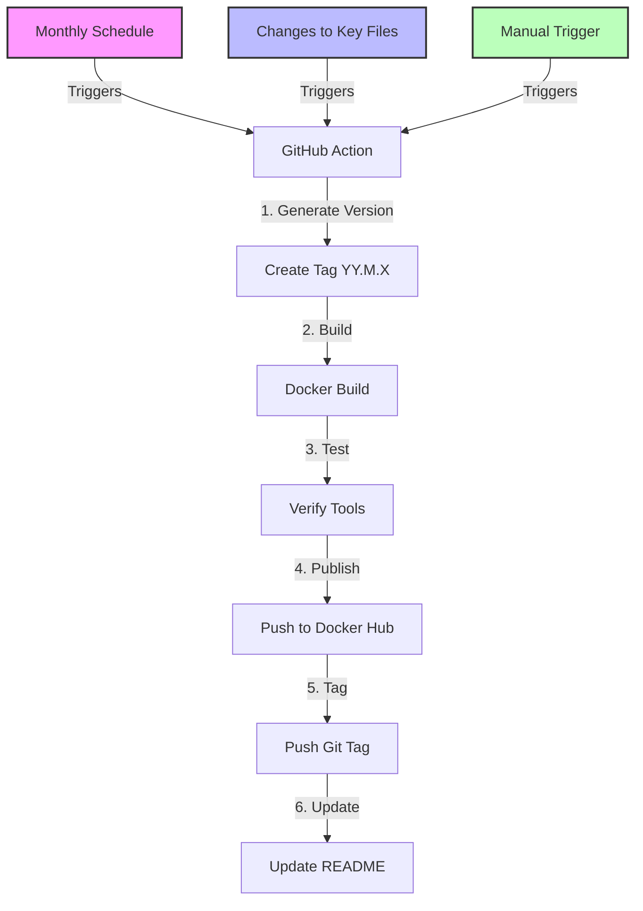

# Docker Base Image Repository

A complete solution for maintaining and publishing a custom Docker base image with your commonly used development tools.

## Overview

This repository contains everything needed to build, test, and publish a standard Docker base image that includes your preferred set of development tools. This approach offers several advantages:

- **Consistency**: Use the same development environment across all your projects
- **Efficiency**: Reduce setup time for new projects
- **Maintenance**: Update tools in one place rather than in each project
- **Automation**: Fully automated versioning and publishing workflow

## Automated Workflow

This repository features a fully automated CI/CD workflow for building and publishing your base image:



### Versioning Schema

Images are automatically tagged using the format `YY.M.X` where:
- `YY` = Last two digits of the current year
- `M` = Current month (without leading zero)
- `X` = Build number for the month (starting at 0)

For example:
- `25.3.0` - First build in March 2025
- `25.3.1` - Second build in March 2025
- `25.4.0` - First build in April 2025

## Getting Started

### Prerequisites

- [Docker](https://docs.docker.com/get-docker/) installed locally
- [GitHub](https://github.com/) account
- [Docker Hub](https://hub.docker.com/) account

### Initial Setup

1. Clone this repository:
   ```bash
   git clone https://github.com/yourusername/base-docker-repo.git
   cd base-docker-repo
   ```

2. Customize the `Dockerfile` with your commonly used tools

3. Update the image name in the workflow:
   - Edit `.github/workflows/docker-build.yml` to use your Docker Hub username

4. Set up GitHub repository secrets:
   - `DOCKERHUB_USERNAME`: Your Docker Hub username
   - `DOCKERHUB_TOKEN`: A Docker Hub access token (create one in Docker Hub settings)

## Usage

### Local Development

```bash
# Make scripts executable
chmod +x scripts/*.sh tests/*.sh

# Build the base image locally
./scripts/build.sh

# Test tools in the image
./tests/verify-tools.sh yourusername/base-dev-image:latest
```

### Automated Publishing

The GitHub Actions workflow handles publishing automatically:

1. **Monthly Builds**: On the 1st of each month, a new image is built and published
2. **Change-Based Builds**: When you push changes to key files, a new build is triggered
3. **Manual Builds**: You can trigger a build from the GitHub Actions UI

No manual version management is needed - the workflow automatically increments version numbers.

## Using Your Base Image in Projects

Once published, you can use your base image in your projects:

```dockerfile
# In your project's Dockerfile
FROM yourusername/base-dev-image:25.3.0  # Use a specific version
# or
FROM yourusername/base-dev-image:latest  # Always use the latest

# Add project-specific setup
COPY . /app
WORKDIR /app

# Run your application
CMD ["python", "app.py"]
```

See the [Using Your Base Image](docs/using-base-image.md) guide for detailed instructions.

## Customizing

### Adding Tools

Edit the `Dockerfile` to add your preferred tools:

```dockerfile
# Example: Adding Node.js
RUN curl -sL https://deb.nodesource.com/setup_18.x | bash - \
    && apt-get install -y nodejs \
    && npm install -g yarn typescript eslint
```

### Adding Configuration Files

You can include configuration files in your base image:

```dockerfile
# Example: Adding global Git configuration
COPY config/.gitconfig /root/.gitconfig
```

### Language-Specific Setups

Add sections for your programming languages:

```dockerfile
# Python setup
COPY requirements-base.txt /tmp/
RUN pip install --no-cache-dir -r /tmp/requirements-base.txt

# Go setup
RUN wget https://golang.org/dl/go1.18.linux-amd64.tar.gz \
    && tar -C /usr/local -xzf go1.18.linux-amd64.tar.gz \
    && rm go1.18.linux-amd64.tar.gz
ENV PATH=$PATH:/usr/local/go/bin
```

## Repository Structure

```
base-docker-repo/
├── Dockerfile              # Defines your base image with common tools
├── .github/
│   └── workflows/
│       └── docker-build.yml # GitHub Actions pipeline for building and publishing
├── scripts/
│   └── build.sh            # Helper script for local building
├── tests/                  # Tests to verify the image works as expected
│   └── verify-tools.sh
└── README.md               # Documentation
```

## Best Practices

1. **Pin Base Image Versions**: Use specific versions for your base images
2. **Minimize Image Size**: Use multi-stage builds and clean up unnecessary files
3. **Test Thoroughly**: Ensure all tools work as expected before publishing
4. **Document Tools**: Keep a list of included tools updated in your documentation
5. **Security Updates**: Regularly rebuild to get the latest security patches

## Contributing

Contributions are welcome! Please feel free to submit a Pull Request.

1. Fork the repository
2. Create your feature branch (`git checkout -b feature/amazing-feature`)
3. Commit your changes (`git commit -m 'Add some amazing feature'`)
4. Push to the branch (`git push origin feature/amazing-feature`)
5. Open a Pull Request

## License

This project is licensed under the MIT License - see the [LICENSE](LICENSE) file for details.

---

Latest version: 25.3.0